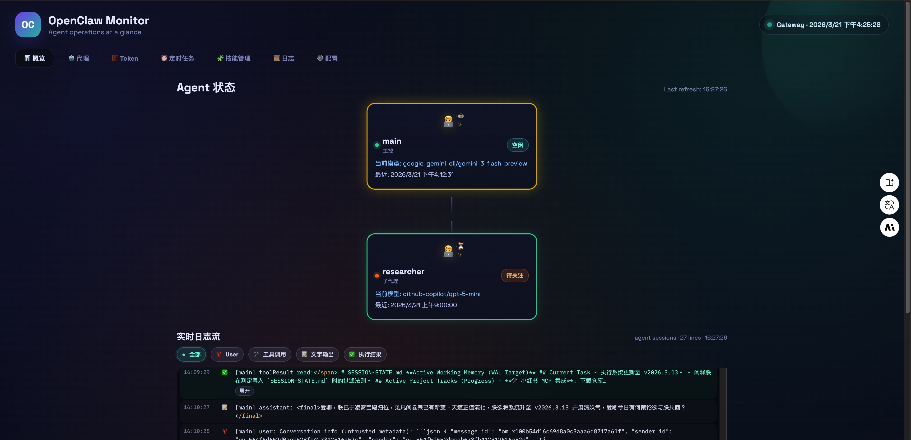
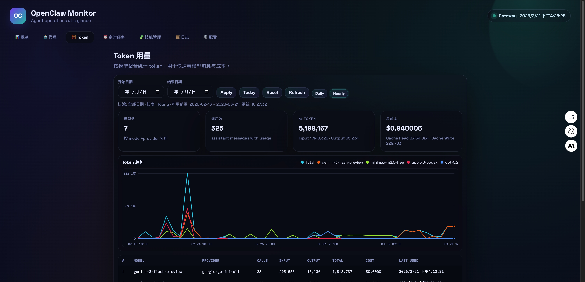

# OpenClaw Monitor Dashboard

Local monitoring dashboard for OpenClaw agents. By default the server reads data from `~/.openclaw` and serves a UI on port `17788`.

## Dashboard Preview

### Overview



### Token Usage



## Run

```bash
node server.js
```

Open `http://localhost:17788` in your browser.

`server.js` now runs with hot reload by default. Changes in `server.js` and `public/` will auto-restart the server.

The repository root `.env` file is loaded automatically by both `node server.js` and `./ocd`.

To disable hot reload:

```bash
OPENCLAW_HOT_RELOAD=0 node server.js
```

## Runtime Paths

Env source priority is: shell env var > repo `.env` > built-in default.

Path priority is: explicit path env var > `OPENCLAW_HOME` derived path > default path.

Core env vars:

- `OPENCLAW_HOME` (default: `~/.openclaw`)
- `OPENCLAW_CONFIG_PATH` (default: `$OPENCLAW_HOME/openclaw.json`)
- `OPENCLAW_AGENTS_DIR` (default: `$OPENCLAW_HOME/agents`)
- `OPENCLAW_LOGS_DIR` (default: `$OPENCLAW_HOME/logs`)
- `OPENCLAW_CRON_JOBS_PATH` (default: `$OPENCLAW_HOME/cron/jobs.json`)
- `OPENCLAW_SKILLS_DIR` (default: `$OPENCLAW_HOME/skills`)
- `OPENCLAW_INSTALL_DIR` (optional, overrides OpenClaw install-dir discovery)

Example `.env`:

```dotenv
OPENCLAW_HOME=/Users/yourname/.openclaw-dev
OPENCLAW_CONFIG_PATH=/Users/yourname/.openclaw-dev/openclaw.json
OPENCLAW_AGENTS_DIR=/Users/yourname/.openclaw-dev/agents
OPENCLAW_LOGS_DIR=/Users/yourname/.openclaw-dev/logs
```

CLI daemon runtime env vars:

- `OCD_STATE_DIR` (optional; default: `<repo>/.ocd`)
- Daemon files are fixed under `$OCD_STATE_DIR`: `ocd.pid`, `ocd.log`, `ocd.err.log`

Optional log-file overrides:

- `OPENCLAW_GATEWAY_LOG_PATH` (default: `$OPENCLAW_LOGS_DIR/gateway.log`)
- `OPENCLAW_GATEWAY_ERROR_LOG_PATH` (default: `$OPENCLAW_LOGS_DIR/gateway.err.log`)

Startup now performs path self-checks. Required directories are invalid/missing -> process exits with non-zero code.

Inspect effective runtime paths and check results via:

```bash
curl http://localhost:17788/api/runtime
```

## Cloud Deploy (systemd)

Example service snippet:

```ini
[Service]
WorkingDirectory=/opt/openclaw-monitor-dashboard
ExecStart=/usr/bin/node /opt/openclaw-monitor-dashboard/server.js
Environment=OPENCLAW_HOME=/data/openclaw
Environment=OPENCLAW_INSTALL_DIR=/usr/lib/node_modules/openclaw
Restart=always
```

## CLI

Use the local CLI `ocd` from repository root:

```bash
./ocd start
```

Start in background (daemon mode):

```bash
./ocd start --daemon
```

Check service status:

```bash
./ocd status
```

Daemon runtime files:

- PID: `<repo>/.ocd/ocd.pid` (or `$OCD_STATE_DIR/ocd.pid`)
- stdout log: `<repo>/.ocd/ocd.log` (or `$OCD_STATE_DIR/ocd.log`)
- stderr log: `<repo>/.ocd/ocd.err.log` (or `$OCD_STATE_DIR/ocd.err.log`)

## Data Sources

- `$OPENCLAW_CONFIG_PATH` (default: `~/.openclaw/openclaw.json`)
- `$OPENCLAW_GATEWAY_LOG_PATH` (default: `~/.openclaw/logs/gateway.log`)
- `$OPENCLAW_GATEWAY_ERROR_LOG_PATH` (default: `~/.openclaw/logs/gateway.err.log`)
- `$OPENCLAW_AGENTS_DIR/*/sessions/sessions.json` (default: `~/.openclaw/agents/*/sessions/sessions.json`)
- `$OPENCLAW_AGENTS_DIR/*/sessions/*.jsonl` (default: `~/.openclaw/agents/*/sessions/*.jsonl`)

## Notes

- The dashboard exposes a sanitized view of the config. Tokens and secrets are not returned.
- Agent status is inferred from the latest matching log entry per binding.
